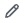

# Setting up your profile

Your profile tells people who you are and what you're interested in.

## About your profile

Your profile page on GitHub is a place where people can find out more about you. You can use your profile to:

* **Share** your interests and skills.
* **Showcase** your projects and contributions.
* **Express** your identity and show the GitHub community who you are.

In this tutorial, you'll learn how to personalize your profile by adding a profile picture, bio, and a profile README.

You'll also learn the basics of Markdown syntax, which is what you'll use to format any writing you do on GitHub.

## Prerequisites

* You must have a GitHub account. For more information, see [Creating an account on GitHub](creating-an-account-on-github.md).

## Adding a profile picture and bio

First, we'll add a picture to your profile. Your profile picture helps identity you across GitHub.

### Adding a profile picture

1. In the upper-right corner of any page, click your existing profile avatar, then from the dropdown menu, click **Settings**.
2. Under "Profile Picture", select  **Edit**, then click **Upload a photo...**.

3. Select an image, then click **Upload**.
4. Crop your picture.
5. Click **Set new profile picture**.

Next, we'll add some basic information about yourself to share with other GitHub users. This information will display below your profile picture on your profile page.

### Adding a bio

1. On your profile page, under your profile picture, click **Edit profile**.
2. Under "Bio", write one or two sentences about yourself, such as who your are and what you do.
    > [!NOTE]
    > Keep the bio short; we'll add a longer description of your interests in your profile README in the section below.
3. To add an emoji to your bio, visit [Emoji cheat sheet](https://www.webfx.com/tools/emoji-cheat-sheet/) and copy and paste an emoji into the "Bio" dialog box.
4. Optionally, add your preferred pronouns, workspace, location and timezone, and any links to your personal website and social accounts, Your pronouns will only be visible to users that are signed in to GitHub.
5. Click **Save**.

## Adding a profile README

Next, we'll create a special repository and README file that will be displayed directly on your profile page.

Your profile README contains information such as your interests, skills, and background, and it can be a great way to introduce yourself to other people on GitHub and showcase your work.

As we learned in the [Hello World](hello-world.md) tutorial, `README.md` files are written using Markdown syntax (note the `.md` file extension), which is just a way to format plain text.

In the following steps, we'll create and edit your profile README.

### Step 1: Create a new repository for your profile README

1. In the upper-right corner of any page, select `+`, then click **New repository**.

2. Under "Repository name", type a repository name that matches your GitHub username. For example, if your username is "octocat", the repository name must be "octocat".
3. Optionally, in the "Description" field, type a description of your repository. For example, "My personal repository".
4. Select **Public**.
5. Toggle **Add README** to **On**.
6. Click **Create repository**.

### Step 2: Edit the `README.md` file

1. Click the  next to your profie README.

2. In the "Edit" view, you'll see some pre-populated text to get you started. On line 1, delete the text that says `### Hi there` and type `# About me`.
    * In Markdown syntax, `###` renders the plain text as a small ("third-level") heading, while `##` or `#` renders a second- and first-level heading respectively.
3. Toggle to "Preview" to set how the plain text now renders. You should see the new text displayed as a much large heading.
4. Toggle back to the "Edit" view.
5. Delete line 3 and line 16.
    * This HTML syntax (e.g. `<!--`) is keeping the other lines hidden when you toggle to "Preview".
6. Complete some of the prompts on lines 8 to 15, and delete any lines you don't want. For example, add your interests, skills, hobbies, or a fun fact about yourself.
7. Now, toggle to "Preview". You should see your completed prompts render as a bulleted list.
8. Toggle back to "Edit" and remove any other lines of text that you don't want displayed on your profile.
9. Keep customizing and editing your profile README.
    * Use the [Emoji cheat sheet](https://www.webfx.com/tools/emoji-cheat-sheet/) to add emojis.
    * Use the [Markdown cheat sheet](https://www.markdownguide.org/cheat-sheet/) to experiment with additional Markdown formatting.

### Step 3: Publish your changes to your profile

1. When you're happy with how your profile README looks in "Preview", and you're ready to publish it, click **Commit changes...**.
2. In the open dialog box, simply click again **Commit changes**.
4. Navigate back to your profile page. You will see your new profile README displayed on your profile.